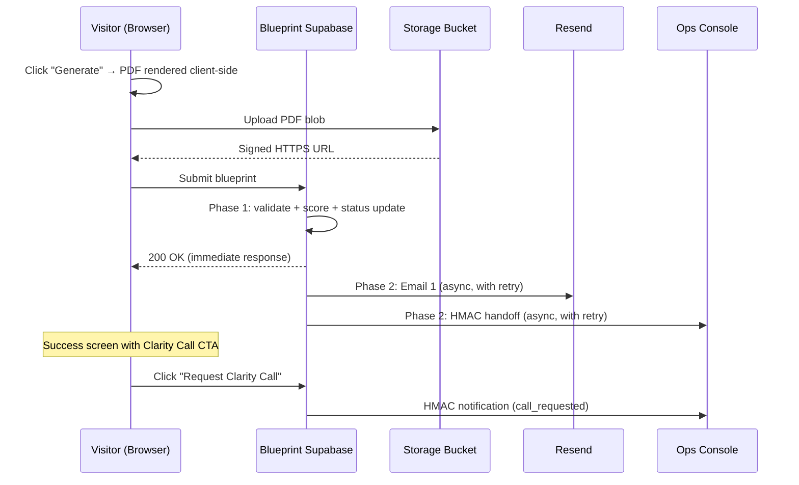

# Blueprint Configurator Backend — Design Document

> **Date:** 2026-02-22
> **Status:** Pending approval (v2 — with refinements)
> **Scope:** Fresh Supabase backend for `ovfctbpwclkrbfjjzssj` (replaces deprecated `nvbjevpuyxizqpqfftpy`)

---

## 1. System Overview

The Blueprint Configurator captures website design requirements from anonymous visitors across a 10-step flow (3 acts). On submission it:

1. Calculates integrity + complexity scores, derives a tier
2. Generates a branded PDF summary client-side
3. Uploads the PDF to Supabase Storage
4. Returns success to the user **immediately** (Phase 1 — synchronous)
5. Sends **Email 1** (submission receipt + PDF) via Resend (Phase 2 — async/resilient)
6. Fires an HMAC-signed payload to the Ops Console (Phase 2 — async/resilient)
7. Exposes 3 proxy endpoints for Console admin actions
8. Offers a **"Request Clarity Call"** CTA on the success screen — notifies the Console of high-intent leads

### Responsibility Boundary

| System | Owns |
|--------|------|
| **Blueprint Configurator** | Data capture, scoring, PDF generation, Email 1 (receipt), HMAC handoff, clarity call intent |
| **Ops Console** | Receiving submissions, email sequences, CRM, follow-up comms, bookings, admin actions |



---

## 2. Database Schema

### 2.1 `blueprints` — Core Table

| Column | Type | Notes |
|--------|------|-------|
| `id` | `uuid` PK | Default `gen_random_uuid()` |
| `session_token` | `text` NOT NULL UNIQUE | Cryptographically random (`crypto.randomUUID()`) |
| `status` | `text` NOT NULL | `draft` → `submitted` → `generated` |
| `first_name` | `text` | From "Your Details" (split field) |
| `last_name` | `text` | From "Your Details" (split field) |
| `user_email` | `text` | Email from "Your Details" |
| `business_name` | `text` | Optional company name |
| `dream_intent` | `text` | Persistent HUD field |
| `discovery` | `jsonb` | Act I answers (BlueprintDiscovery) |
| `design` | `jsonb` | Act II answers (BlueprintDesign) |
| `deliver` | `jsonb` | Act III answers (BlueprintDeliver) |
| `current_step` | `integer` DEFAULT 1 | Progress tracker |
| `integrity_score` | `numeric` | Calculated on submission |
| `complexity_score` | `numeric` | Calculated on submission |
| `complexity_tier` | `text` | `essential` / `growth` / `enterprise` |
| `pdf_url` | `text` | HTTPS URL in Storage |
| `clarity_call_requested_at` | `timestamptz` | Set when user clicks CTA |
| `archived_at` | `timestamptz` | Soft-delete timestamp |
| `created_at` | `timestamptz` DEFAULT now() | |
| `updated_at` | `timestamptz` DEFAULT now() | |
| `submitted_at` | `timestamptz` | Set on submission |

### 2.2 `blueprint_references` — Uploaded Files & Links

| Column | Type | Notes |
|--------|------|-------|
| `id` | `uuid` PK | |
| `blueprint_id` | `uuid` FK → blueprints | ON DELETE CASCADE |
| `type` | `text` | `image` / `pdf` / `link` |
| `url` | `text` NOT NULL | |
| `filename` | `text` | |
| `notes` | `text` | |
| `storage_path` | `text` | Path in Storage bucket |
| `role` | `text` | `hero_reference`, `layout_reference`, etc. |
| `label` | `text` | |
| `created_at` | `timestamptz` DEFAULT now() | |

### 2.3 `blueprint_emails` — Email 1 Tracking

| Column | Type | Notes |
|--------|------|-------|
| `id` | `uuid` PK | |
| `blueprint_id` | `uuid` FK → blueprints | |
| `email_type` | `text` NOT NULL | `submission_receipt` |
| `status` | `text` NOT NULL | `pending` / `sent` / `failed` |
| `recipient` | `text` NOT NULL | |
| `resend_id` | `text` | Resend message ID |
| `error` | `text` | Error message if failed |
| `sent_at` | `timestamptz` | |
| `created_at` | `timestamptz` DEFAULT now() | |

### 2.4 `blueprint_audit_log` — Security & Event Log

| Column | Type | Notes |
|--------|------|-------|
| `id` | `uuid` PK | |
| `blueprint_id` | `uuid` FK → blueprints (nullable) | |
| `event_type` | `text` NOT NULL | See event types below |
| `description` | `text` | Human-readable detail |
| `ip_address` | `inet` | Request source IP |
| `user_agent` | `text` | |
| `metadata` | `jsonb` | Extra context |
| `created_at` | `timestamptz` DEFAULT now() | |

**Event types:** `submission_created`, `pdf_generated`, `email_sent`, `email_failed`, `hmac_handoff_success`, `hmac_handoff_failed`, `hmac_verification_success`, `hmac_verification_failed`, `blueprint_archived`, `blueprint_duplicate_attempt`, `email_resent`, `clarity_call_requested`, `clarity_call_notified`

---

## 3. RLS Policies

> [!IMPORTANT]
> Lesson from old project: **never table-qualify column refs in INSERT WITH CHECK clauses.**

### `blueprints`
| Operation | Policy |
|-----------|--------|
| SELECT | Session token match via `x-blueprint-token` header |
| INSERT | Unrestricted for `anon` (new blueprint creation) |
| UPDATE | Session token match |

### `blueprint_references`
| Operation | Policy |
|-----------|--------|
| SELECT | Blueprint's session token matches header |
| INSERT | Blueprint's session token matches (unqualified `blueprint_id`) |
| UPDATE | Same as SELECT |
| DELETE | Same as SELECT |

### `blueprint_emails`, `blueprint_audit_log`
- **No direct client access.** Written exclusively by Edge Functions via `service_role`.

> [!NOTE]
> No `is_studio_user()` function needed. All admin access flows through the Console's proxy endpoints, which use HMAC auth + `service_role`. Studio users never authenticate directly against this project.

---

## 4. Scoring Engine

Runs synchronously in Phase 1 of `submit-blueprint`. Weights stored as a configurable const object for easy tuning.

### 4.1 Complexity Score (0–100)

| Signal | Weight | Scoring |
|--------|--------|---------|
| Pages count | 20% | 1-3→20, 4-6→50, 7+→90 |
| Features count | 25% | Per feature: +15 (max 100) |
| Animation intensity | 10% | Direct map (1-10 → 10-100) |
| Creative risk | 10% | Direct map (1-10 → 10-100) |
| Timeline urgency | 15% | urgent→100, 4_6_weeks→70, 6_10_weeks→40, flexible→20 |
| Budget bracket | 20% | under_5k→20, 5_10k→50, 10_25k→80, flexible→60 |

### 4.2 Integrity Score (0–100)

| Signal | Weight | Scoring |
|--------|--------|---------|
| Required fields complete | 30% | % of non-empty core fields |
| References uploaded | 15% | 0→0, 1→50, 2→75, 3+→100 |
| Dream intent set | 10% | Empty→0, Non-empty→100 |
| Brand voice configured | 15% | % of 3 axes set |
| Conversion goals | 15% | 0→0, 1→50, 2+→100 |
| Contact info completeness | 15% | Name+email→70, +company→100 |

### 4.3 Tier Derivation

| Complexity Score | Tier |
|-----------------|------|
| 0–30 | `essential` |
| 31–60 | `growth` |
| 61–100 | `enterprise` |

---

## 5. Edge Functions

### 5.1 `submit-blueprint` (Blueprint-owned)

**Two-phase architecture:**

| Phase | Scope | Failure behavior |
|-------|-------|-------------------|
| **Phase 1** (sync) | Validate + score + status update + return 200 | Hard fail → user sees error |
| **Phase 2** (async) | Email 1 + HMAC handoff | Soft fail → logged in audit, retryable |

### 5.2 `request-clarity-call` (Blueprint-owned)
**Trigger:** User clicks "Request Clarity Call" CTA on success screen
**Does:**
1. Sets `clarity_call_requested_at` on the blueprint
2. Fires HMAC-signed notification to Console with `{ blueprint_id, lead, tier, requested_at }`
3. Logs `clarity_call_requested` in audit log

### 5.3 `get-blueprint-report-snapshot` (Console reads from Blueprint)
**Auth:** HMAC verification (colon-separated format)
**Returns:** Paginated `BlueprintSnapshot[]` with:
- `email_sequences` → Only Email 1 record from `blueprint_emails`
- `bookings` → Empty array (Console owns this)
- `security_events` → Audit log entries for that blueprint

### 5.4 `resend-email-1` (Console triggers re-send)
**Auth:** HMAC verification
**Does:** Re-sends Email 1 using stored `pdf_url`

### 5.5 `soft-delete-blueprint` (Console archives)
**Auth:** HMAC verification
**Does:** Sets `archived_at = now()`

### 5.6 `_shared/hmac.ts` — Shared HMAC Utilities
- `signPayload(secret, timestamp, body)` → no-separator (Blueprint → Console)
- `verifySignature(secret, timestamp, body, sig)` → colon-separator (Console → Blueprint)

---

## 6. Clarity Call CTA — Post-Submission

After PDF generation, the success screen shows:

```
┌─────────────────────────────────────────────┐
│  ✅  Your Blueprint is Ready                │
│                                             │
│  [Download PDF]                             │
│                                             │
│  ────────────────────────────────────────── │
│                                             │
│  📞  Request a Clarity Call                 │
│                                             │
│  We'll walk through your Blueprint          │
│  together — discuss what's possible,        │
│  what's realistic, and whether we're        │
│  the right fit.                             │
│                                             │
│  [Request a Clarity Call →]                 │
│                                             │
└─────────────────────────────────────────────┘
```

**On click:**
- Edge Function `request-clarity-call` fires
- Console receives HMAC-signed notification with lead context + tier
- Blueprint shows confirmation: "We'll be in touch shortly"
- Button disables (no double-requests)

**Why this works:** The user is at **peak engagement** right after seeing their PDF. This is warm-lead capture at the moment of highest intent. The Console team sees this submission flagged as `call_requested` and can prioritize outreach.

---

## 7. Storage

**Single bucket:** `blueprint-assets` (private)
```
blueprint-assets/
  ├── references/{blueprint_id}/image1.png
  └── pdfs/{blueprint_id}/blueprint.pdf
```

- Upload policy: `anon` can INSERT
- Read policy: via signed URLs (60-min for references, 7-day for PDFs)

---

## 8. Email 1 — Submission Receipt

**Provider:** Resend
**Template:** HTML email with submission summary, tier badge, PDF download link (signed URL, 7-day expiry)
**Trigger:** Phase 2 of `submit-blueprint` (async, retryable)
**Tracking:** `blueprint_emails` table with `resend_id` for delivery status

---

## 9. Security Summary

| Control | Implementation |
|---------|---------------|
| HMAC secrets | Edge Function env only |
| RLS | Session-token-based, no `is_studio_user()` needed |
| Audit logging | All events logged with IP + user agent |
| Input validation | Zod schemas in Edge Functions |
| Replay protection | 5-min timestamp drift + idempotent submission_id |
| Soft delete | `archived_at`, no hard deletes |
| Session tokens | `crypto.randomUUID()` for sufficient entropy |
| Scoring weights | Configurable const object, easy to tune |

---

## 10. Frontend Changes Required

1. **Split "Your Name" → "First Name" + "Last Name"** on the Review step
2. **PDF generation module** — `html2canvas` + `jsPDF`
3. **Submission flow** — Two-phase: sync scoring → async email/handoff
4. **Success screen** — Add Clarity Call CTA with `request-clarity-call` integration
5. **Storage upload** — Wire PDF upload to `blueprint-assets/pdfs/` path

---

## 11. Migration Strategy

| Step | Action |
|------|--------|
| 1 | Apply fresh schema migration to new project |
| 2 | Create Storage bucket with RLS policies |
| 3 | Deploy Edge Functions |
| 4 | Set HMAC + Resend secrets as Edge Function env |
| 5 | Update frontend `.env` (already done) |
| 6 | Split name field in Review step UI |
| 7 | Build PDF generation + submission flow |
| 8 | Build success screen with Clarity Call CTA |
| 9 | Test end-to-end locally |
| 10 | Coordinate HMAC secret with Ops Console |
| 11 | Deprecate old project |
