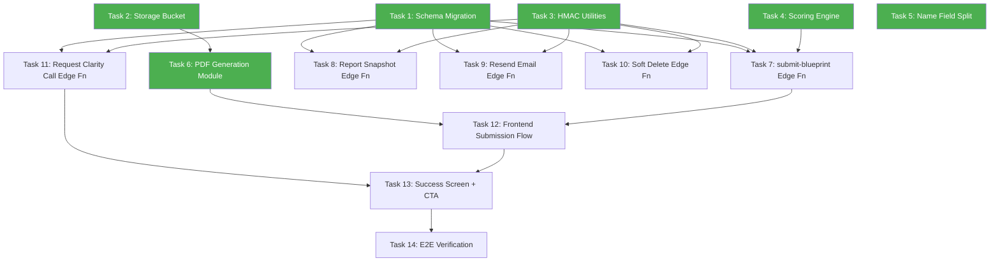

# Blueprint Backend Setup — Implementation Plan

> **For Claude:** REQUIRED SUB-SKILL: Use superpowers:executing-plans to implement this plan task-by-task.

**Goal:** Stand up the complete Supabase backend for the Blueprint Configurator on project `ovfctbpwclkrbfjjzssj`, including schema, Edge Functions, scoring, PDF generation, Email 1, HMAC integration, and Clarity Call CTA.

**Architecture:** Two-phase submission (sync scoring → async email/handoff), client-side PDF generation, HMAC-signed server-to-server communication with Ops Console, session-token-based RLS.

**Tech Stack:** Supabase (Postgres, Edge Functions, Storage), Deno, Resend, html2canvas + jsPDF, Zod, HMAC-SHA256.

**Design Doc:** [2026-02-22-backend-setup-design.md](file:///Users/kingjoshua/Desktop/Cleland.Studios/projects/blueprint_config/docs/plans/2026-02-22-backend-setup-design.md)

---

## Parallelization Map



**Green = parallelizable (no dependencies, can be assigned to separate agents)**

| Batch | Tasks | Can Parallelize? |
|-------|-------|-----------------|
| **Batch A** | Tasks 1–6 | ✅ All independent |
| **Batch B** | Tasks 7–11 | ✅ All depend on Batch A, but independent of each other |
| **Batch C** | Tasks 12–13 | ⚠️ Sequential (12 before 13) |
| **Batch D** | Task 14 | ❌ Depends on all above |

---

## Batch A — Foundation (All Parallelizable)

---

### Task 1: Database Schema Migration

**Agent assignment:** Any agent with Supabase MCP access
**Files:**
- Create: `supabase/migrations/20260222120000_blueprint_backend_v2.sql`

**Step 1: Write the migration SQL**

```sql
-- Blueprint Backend v2 — Fresh schema for ovfctbpwclkrbfjjzssj

-- 1. blueprints
CREATE TABLE public.blueprints (
  id uuid PRIMARY KEY DEFAULT gen_random_uuid(),
  session_token text NOT NULL UNIQUE,
  status text NOT NULL DEFAULT 'draft'
    CHECK (status IN ('draft', 'submitted', 'generated')),
  first_name text,
  last_name text,
  user_email text,
  business_name text,
  dream_intent text,
  discovery jsonb DEFAULT '{}'::jsonb,
  design jsonb DEFAULT '{}'::jsonb,
  deliver jsonb DEFAULT '{}'::jsonb,
  current_step integer DEFAULT 1,
  integrity_score numeric,
  complexity_score numeric,
  complexity_tier text
    CHECK (complexity_tier IS NULL OR complexity_tier IN ('essential', 'growth', 'enterprise')),
  pdf_url text,
  clarity_call_requested_at timestamptz,
  archived_at timestamptz,
  created_at timestamptz DEFAULT now(),
  updated_at timestamptz DEFAULT now(),
  submitted_at timestamptz
);

-- 2. blueprint_references
CREATE TABLE public.blueprint_references (
  id uuid PRIMARY KEY DEFAULT gen_random_uuid(),
  blueprint_id uuid NOT NULL REFERENCES public.blueprints(id) ON DELETE CASCADE,
  type text NOT NULL CHECK (type IN ('image', 'pdf', 'link')),
  url text NOT NULL,
  filename text,
  notes text,
  storage_path text,
  role text,
  label text,
  created_at timestamptz DEFAULT now()
);

-- 3. blueprint_emails
CREATE TABLE public.blueprint_emails (
  id uuid PRIMARY KEY DEFAULT gen_random_uuid(),
  blueprint_id uuid NOT NULL REFERENCES public.blueprints(id) ON DELETE CASCADE,
  email_type text NOT NULL DEFAULT 'submission_receipt',
  status text NOT NULL DEFAULT 'pending'
    CHECK (status IN ('pending', 'sent', 'failed')),
  recipient text NOT NULL,
  resend_id text,
  error text,
  sent_at timestamptz,
  created_at timestamptz DEFAULT now()
);

-- 4. blueprint_audit_log
CREATE TABLE public.blueprint_audit_log (
  id uuid PRIMARY KEY DEFAULT gen_random_uuid(),
  blueprint_id uuid REFERENCES public.blueprints(id) ON DELETE SET NULL,
  event_type text NOT NULL,
  description text,
  ip_address inet,
  user_agent text,
  metadata jsonb,
  created_at timestamptz DEFAULT now()
);

-- Indexes
CREATE INDEX idx_blueprints_session_token ON public.blueprints(session_token);
CREATE INDEX idx_blueprints_status ON public.blueprints(status);
CREATE INDEX idx_blueprints_submitted_at ON public.blueprints(submitted_at);
CREATE INDEX idx_blueprint_references_blueprint_id ON public.blueprint_references(blueprint_id);
CREATE INDEX idx_audit_log_blueprint_id ON public.blueprint_audit_log(blueprint_id);
CREATE INDEX idx_audit_log_event_type ON public.blueprint_audit_log(event_type);

-- Enable RLS
ALTER TABLE public.blueprints ENABLE ROW LEVEL SECURITY;
ALTER TABLE public.blueprint_references ENABLE ROW LEVEL SECURITY;
ALTER TABLE public.blueprint_emails ENABLE ROW LEVEL SECURITY;
ALTER TABLE public.blueprint_audit_log ENABLE ROW LEVEL SECURITY;

-- RLS: blueprints
CREATE POLICY "anon_insert_blueprints"
  ON public.blueprints FOR INSERT TO anon
  WITH CHECK (true);

CREATE POLICY "session_select_blueprints"
  ON public.blueprints FOR SELECT TO anon
  USING (
    session_token = COALESCE(
      (current_setting('request.headers', true)::json ->> 'x-blueprint-token'),
      ''
    )
  );

CREATE POLICY "session_update_blueprints"
  ON public.blueprints FOR UPDATE TO anon
  USING (
    session_token = COALESCE(
      (current_setting('request.headers', true)::json ->> 'x-blueprint-token'),
      ''
    )
  );

-- RLS: blueprint_references (IMPORTANT: unqualified blueprint_id in INSERT)
CREATE POLICY "session_select_references"
  ON public.blueprint_references FOR SELECT TO anon
  USING (
    EXISTS (
      SELECT 1 FROM public.blueprints b
      WHERE b.id = blueprint_references.blueprint_id
      AND b.session_token = COALESCE(
        (current_setting('request.headers', true)::json ->> 'x-blueprint-token'),
        ''
      )
    )
  );

CREATE POLICY "session_insert_references"
  ON public.blueprint_references FOR INSERT TO anon
  WITH CHECK (
    EXISTS (
      SELECT 1 FROM public.blueprints b
      WHERE b.id = blueprint_id
      AND b.session_token = COALESCE(
        (current_setting('request.headers', true)::json ->> 'x-blueprint-token'),
        ''
      )
    )
  );

CREATE POLICY "session_update_references"
  ON public.blueprint_references FOR UPDATE TO anon
  USING (
    EXISTS (
      SELECT 1 FROM public.blueprints b
      WHERE b.id = blueprint_references.blueprint_id
      AND b.session_token = COALESCE(
        (current_setting('request.headers', true)::json ->> 'x-blueprint-token'),
        ''
      )
    )
  );

CREATE POLICY "session_delete_references"
  ON public.blueprint_references FOR DELETE TO anon
  USING (
    EXISTS (
      SELECT 1 FROM public.blueprints b
      WHERE b.id = blueprint_references.blueprint_id
      AND b.session_token = COALESCE(
        (current_setting('request.headers', true)::json ->> 'x-blueprint-token'),
        ''
      )
    )
  );

-- RLS: blueprint_emails + audit_log — service_role only (no anon/authenticated access)
CREATE POLICY "service_role_all_emails"
  ON public.blueprint_emails FOR ALL TO service_role
  USING (true) WITH CHECK (true);

CREATE POLICY "service_role_all_audit"
  ON public.blueprint_audit_log FOR ALL TO service_role
  USING (true) WITH CHECK (true);

-- updated_at trigger
CREATE OR REPLACE FUNCTION public.set_updated_at()
RETURNS TRIGGER AS $$
BEGIN
  NEW.updated_at = now();
  RETURN NEW;
END;
$$ LANGUAGE plpgsql;

CREATE TRIGGER blueprints_updated_at
  BEFORE UPDATE ON public.blueprints
  FOR EACH ROW EXECUTE FUNCTION public.set_updated_at();
```

**Step 2: Apply via Supabase MCP**

```bash
# Apply using MCP apply_migration tool
# project_id: ovfctbpwclkrbfjjzssj
# name: blueprint_backend_v2
```

**Step 3: Verify tables exist**

```sql
SELECT table_name FROM information_schema.tables
WHERE table_schema = 'public'
ORDER BY table_name;
-- Expected: blueprint_audit_log, blueprint_emails, blueprint_references, blueprints
```

---

### Task 2: Storage Bucket Setup

**Agent assignment:** Any agent with Supabase MCP access
**Files:** None (MCP operations only)

**Step 1: Create the storage bucket**

```sql
INSERT INTO storage.buckets (id, name, public)
VALUES ('blueprint-assets', 'blueprint-assets', false)
ON CONFLICT (id) DO NOTHING;
```

**Step 2: Create storage RLS policies**

```sql
-- Anon can upload to blueprint-assets
CREATE POLICY "anon_upload_assets"
  ON storage.objects FOR INSERT TO anon
  WITH CHECK (bucket_id = 'blueprint-assets');

-- Anon can read (for signed URLs during session)
CREATE POLICY "anon_read_assets"
  ON storage.objects FOR SELECT TO anon
  USING (bucket_id = 'blueprint-assets');

-- Anon can delete their own uploads
CREATE POLICY "anon_delete_assets"
  ON storage.objects FOR DELETE TO anon
  USING (bucket_id = 'blueprint-assets');
```

**Step 3: Verify bucket exists**

```sql
SELECT id, name, public FROM storage.buckets WHERE id = 'blueprint-assets';
-- Expected: id=blueprint-assets, public=false
```

---

### Task 3: HMAC Shared Utilities

**Agent assignment:** Any agent
**Files:**
- Create: `supabase/functions/_shared/hmac.ts`

**Step 1: Write the HMAC module**

```typescript
// supabase/functions/_shared/hmac.ts
// Signing: Blueprint → Console (no separator)
// Verification: Console → Blueprint (colon separator)

const encoder = new TextEncoder();

async function hmacSha256(secret: string, message: string): Promise<string> {
  const key = await crypto.subtle.importKey(
    'raw',
    encoder.encode(secret),
    { name: 'HMAC', hash: 'SHA-256' },
    false,
    ['sign']
  );
  const sig = await crypto.subtle.sign('HMAC', key, encoder.encode(message));
  return Array.from(new Uint8Array(sig))
    .map(b => b.toString(16).padStart(2, '0'))
    .join('');
}

/** Sign a payload for Blueprint → Console (no separator) */
export async function signPayload(
  secret: string,
  timestamp: string,
  body: string
): Promise<string> {
  return hmacSha256(secret, `${timestamp}${body}`);
}

/** Verify a signature from Console → Blueprint (colon separator) */
export async function verifySignature(
  secret: string,
  timestamp: string,
  body: string,
  signature: string,
  maxDriftSeconds = 300
): Promise<{ valid: boolean; reason?: string }> {
  // Check timestamp drift
  const now = Math.floor(Date.now() / 1000);
  const ts = parseInt(timestamp, 10);
  if (isNaN(ts) || Math.abs(now - ts) > maxDriftSeconds) {
    return { valid: false, reason: 'Timestamp drift exceeded' };
  }

  const expected = await hmacSha256(secret, `${timestamp}:${body}`);

  // Constant-time comparison
  if (expected.length !== signature.length) {
    return { valid: false, reason: 'Signature mismatch' };
  }
  let mismatch = 0;
  for (let i = 0; i < expected.length; i++) {
    mismatch |= expected.charCodeAt(i) ^ signature.charCodeAt(i);
  }
  return mismatch === 0
    ? { valid: true }
    : { valid: false, reason: 'Signature mismatch' };
}
```

**Step 2: Verify it compiles**

Run: `deno check supabase/functions/_shared/hmac.ts`
Expected: No errors

---

### Task 4: Scoring Engine

**Agent assignment:** Any agent
**Files:**
- Create: `supabase/functions/_shared/scoring.ts`

**Step 1: Write the scoring module**

```typescript
// supabase/functions/_shared/scoring.ts

interface ScoringInput {
  discovery: Record<string, unknown>;
  design: Record<string, unknown>;
  deliver: Record<string, unknown>;
  references_count: number;
  dream_intent: string | null;
  first_name: string | null;
  last_name: string | null;
  user_email: string | null;
  business_name: string | null;
}

// ---- Configurable weights (tune without code changes) ----
const COMPLEXITY_WEIGHTS = {
  pages: 0.20,
  features: 0.25,
  animationIntensity: 0.10,
  creativeRisk: 0.10,
  timeline: 0.15,
  budget: 0.20,
} as const;

const INTEGRITY_WEIGHTS = {
  requiredFields: 0.30,
  references: 0.15,
  dreamIntent: 0.10,
  brandVoice: 0.15,
  conversionGoals: 0.15,
  contactInfo: 0.15,
} as const;

const TIMELINE_SCORES: Record<string, number> = {
  urgent: 100, '4_6_weeks': 70, '6_10_weeks': 40, flexible: 20,
};

const BUDGET_SCORES: Record<string, number> = {
  under_5k: 20, '5_10k': 50, '10_25k': 80, flexible: 60,
};

// ---- Scoring functions ----

function clamp(n: number, min = 0, max = 100): number {
  return Math.max(min, Math.min(max, Math.round(n)));
}

export function calculateComplexityScore(input: ScoringInput): number {
  const deliver = input.deliver as Record<string, unknown>;
  const design = input.design as Record<string, unknown>;

  const pages = Array.isArray(deliver.pages) ? deliver.pages.length : 0;
  const features = Array.isArray(deliver.features) ? deliver.features.length : 0;
  const animIntensity = typeof design.animationIntensity === 'number' ? design.animationIntensity : 5;
  const risk = typeof deliver.riskTolerance === 'number' ? deliver.riskTolerance : 5;
  const timeline = typeof deliver.timeline === 'string' ? deliver.timeline : 'flexible';
  const budget = typeof deliver.budget === 'string' ? deliver.budget : 'flexible';

  const pagesScore = pages <= 3 ? 20 : pages <= 6 ? 50 : 90;
  const featuresScore = clamp(features * 15);
  const animScore = clamp(animIntensity * 10);
  const riskScore = clamp(risk * 10);
  const timelineScore = TIMELINE_SCORES[timeline] ?? 50;
  const budgetScore = BUDGET_SCORES[budget] ?? 50;

  const weighted =
    pagesScore * COMPLEXITY_WEIGHTS.pages +
    featuresScore * COMPLEXITY_WEIGHTS.features +
    animScore * COMPLEXITY_WEIGHTS.animationIntensity +
    riskScore * COMPLEXITY_WEIGHTS.creativeRisk +
    timelineScore * COMPLEXITY_WEIGHTS.timeline +
    budgetScore * COMPLEXITY_WEIGHTS.budget;

  return clamp(weighted);
}

export function calculateIntegrityScore(input: ScoringInput): number {
  const discovery = input.discovery as Record<string, unknown>;
  const design = input.design as Record<string, unknown>;

  // Required fields completeness
  const coreFields = [
    discovery.primaryPurpose,
    discovery.salesPersonality,
    design.visualStyle,
    design.typography_direction,
  ];
  const filledCount = coreFields.filter(f => f != null && f !== '').length;
  const fieldsScore = clamp((filledCount / coreFields.length) * 100);

  // References
  const refScore = input.references_count === 0 ? 0
    : input.references_count === 1 ? 50
    : input.references_count === 2 ? 75 : 100;

  // Dream intent
  const intentScore = input.dream_intent ? 100 : 0;

  // Brand voice (3 axes)
  const bv = (discovery.brandVoice as Record<string, unknown>) ?? {};
  const bvAxes = ['tone', 'presence', 'personality'].filter(k => bv[k] != null).length;
  const bvScore = clamp((bvAxes / 3) * 100);

  // Conversion goals
  const goals = Array.isArray(discovery.conversionGoals) ? discovery.conversionGoals : [];
  const goalsScore = goals.length === 0 ? 0 : goals.length === 1 ? 50 : 100;

  // Contact info
  let contactScore = 0;
  if (input.first_name && input.user_email) contactScore = 70;
  if (input.business_name) contactScore = 100;

  const weighted =
    fieldsScore * INTEGRITY_WEIGHTS.requiredFields +
    refScore * INTEGRITY_WEIGHTS.references +
    intentScore * INTEGRITY_WEIGHTS.dreamIntent +
    bvScore * INTEGRITY_WEIGHTS.brandVoice +
    goalsScore * INTEGRITY_WEIGHTS.conversionGoals +
    contactScore * INTEGRITY_WEIGHTS.contactInfo;

  return clamp(weighted);
}

export function deriveTier(complexityScore: number): string {
  if (complexityScore <= 30) return 'essential';
  if (complexityScore <= 60) return 'growth';
  return 'enterprise';
}
```

**Step 2: Verify it compiles**

Run: `deno check supabase/functions/_shared/scoring.ts`
Expected: No errors

---

### Task 5: Split Name Field in Review Step UI

**Agent assignment:** Frontend agent
**Files:**
- Modify: `src/types/blueprint.ts` (replace `userName` with `firstName` / `lastName`)
- Modify: `src/components/configurator/steps/ReviewStep.tsx` (split input fields)
- Modify: `src/hooks/useBlueprint.ts` (update DB mapping)

**Step 1: Update the Blueprint type**

In `src/types/blueprint.ts`, replace:
```typescript
userName?: string;
```
with:
```typescript
firstName?: string;
lastName?: string;
```

**Step 2: Update ReviewStep.tsx**

Replace the single "Your Name" input with two inputs side by side:
- "First Name *" → `blueprint.firstName`
- "Last Name *" → `blueprint.lastName`

**Step 3: Update useBlueprint.ts DB mapping**

In `mapDbToBlueprint`, map `first_name` → `firstName`, `last_name` → `lastName`.
In the save function, map `firstName` → `first_name`, `lastName` → `last_name`.

**Step 4: Verify**

Run: `npm run dev`
Navigate to Review step → verify two name fields render correctly.

---

### Task 6: PDF Generation Module

**Agent assignment:** Frontend agent
**Files:**
- Create: `src/lib/pdfGenerator.ts`
- Install: `html2canvas`, `jspdf`

**Step 1: Install dependencies**

```bash
npm install html2canvas jspdf
```

**Step 2: Write the PDF generator**

Create `src/lib/pdfGenerator.ts` that:
- Takes a `Blueprint` object + `BlueprintReference[]`
- Renders a branded summary layout to an offscreen DOM element
- Captures it with `html2canvas`
- Converts to PDF with `jsPDF`
- Returns a `Blob`

**Step 3: Write the upload helper**

In the same file, export `uploadPdf(blueprintId: string, pdfBlob: Blob): Promise<string>` that:
- Uploads to `blueprint-assets/pdfs/{blueprintId}/blueprint.pdf`
- Returns a signed URL (7-day expiry)

**Step 4: Verify**

Create a simple test: call `generatePdf()` with mock data, verify a Blob is returned with `type: 'application/pdf'`.

---

## Batch B — Edge Functions (All Parallelizable After Batch A)

---

### Task 7: `submit-blueprint` Edge Function

**Agent assignment:** Backend agent
**Files:**
- Create: `supabase/functions/submit-blueprint/index.ts`
**Depends on:** Tasks 1, 3, 4

**Step 1: Write the Edge Function**

Two-phase architecture:

**Phase 1 (sync — return to user):**
1. Validate request body with Zod
2. Fetch blueprint by ID using `service_role`
3. Count references
4. Run scoring engine → get `complexity_score`, `integrity_score`, `complexity_tier`
5. Update blueprint: scores, `status = 'submitted'`, `submitted_at = now()`
6. Log `submission_created` in audit
7. Return `200 OK` with `{ success: true, scores, tier }`

**Phase 2 (async — fire and forget):**
8. Send Email 1 via Resend (with PDF URL)
9. Log email result (`email_sent` or `email_failed`)
10. Fire HMAC-signed POST to Ops Console
11. Log handoff result (`hmac_handoff_success` or `hmac_handoff_failed`)

Use `EdgeRuntime.waitUntil()` or a deferred promise for Phase 2.

**Step 2: Verify locally**

```bash
supabase functions serve submit-blueprint
# Test with curl
```

---

### Task 8: `get-blueprint-report-snapshot` Edge Function

**Agent assignment:** Backend agent
**Files:**
- Create: `supabase/functions/get-blueprint-report-snapshot/index.ts`
**Depends on:** Tasks 1, 3

**Step 1: Write the Edge Function**

1. Verify HMAC (colon-separated format)
2. Parse `page` and `page_size` from query params
3. Query blueprints with pagination (exclude archived)
4. For each blueprint, fetch Email 1 record from `blueprint_emails`
5. For each blueprint, fetch audit log entries from `blueprint_audit_log`
6. Return `SnapshotResponse` shape with:
   - `email_sequences` → Email 1 record only
   - `bookings` → `[]`
   - `security_events` → audit log entries

---

### Task 9: `resend-email-1` Edge Function

**Agent assignment:** Backend agent
**Files:**
- Create: `supabase/functions/resend-email-1/index.ts`
**Depends on:** Tasks 1, 3

**Step 1: Write the Edge Function**

1. Verify HMAC
2. Fetch blueprint by ID
3. Re-send Email 1 via Resend using stored `pdf_url`
4. Update/insert `blueprint_emails` record
5. Log `email_resent` in audit

---

### Task 10: `soft-delete-blueprint` Edge Function

**Agent assignment:** Backend agent
**Files:**
- Create: `supabase/functions/soft-delete-blueprint/index.ts`
**Depends on:** Tasks 1, 3

**Step 1: Write the Edge Function**

1. Verify HMAC
2. Set `archived_at = now()` on the blueprint
3. Log `blueprint_archived` in audit
4. Return `{ success: true }`

---

### Task 11: `request-clarity-call` Edge Function

**Agent assignment:** Backend agent
**Files:**
- Create: `supabase/functions/request-clarity-call/index.ts`
**Depends on:** Tasks 1, 3

**Step 1: Write the Edge Function**

1. Validate blueprint ID from request
2. Set `clarity_call_requested_at = now()` on blueprint
3. Fire HMAC-signed notification to Console:
   ```json
   {
     "version": "1.0",
     "event": "clarity_call_requested",
     "blueprint_id": "...",
     "lead": { "first_name", "last_name", "email", "company" },
     "tier": "growth",
     "requested_at": "ISO 8601"
   }
   ```
4. Log `clarity_call_requested` in audit
5. Return `{ success: true }`

---

## Batch C — Frontend Integration (Sequential)

---

### Task 12: Frontend Submission Flow

**Agent assignment:** Frontend agent
**Files:**
- Modify: `src/hooks/useBlueprint.ts` (submission logic)
- Modify: `src/components/configurator/BlueprintConfigurator.tsx` (wire to submit-blueprint)
**Depends on:** Tasks 6, 7

**Step 1: Update `submitBlueprint` in useBlueprint.ts**

Replace the current submit logic with:
1. Generate PDF client-side (`generatePdf()`)
2. Upload PDF to Storage (`uploadPdf()`)
3. Call `submit-blueprint` Edge Function with `{ blueprint_id, pdf_url }`
4. Return scores + tier to the UI

**Step 2: Update BlueprintConfigurator.tsx**

Wire the "Generate" button to the new flow. Show a loading state during PDF generation + submission.

**Step 3: Verify**

Run locally, complete a blueprint, click Generate. Verify:
- PDF uploads to Storage
- Blueprint status changes to `submitted`
- Scores are returned

---

### Task 13: Success Screen + Clarity Call CTA

**Agent assignment:** Frontend agent
**Files:**
- Modify: `src/components/configurator/SuccessState.tsx`
**Depends on:** Tasks 11, 12

**Step 1: Add Clarity Call CTA to SuccessState**

After the PDF download button, add:
- Section divider
- Headline: "Request a Clarity Call"
- Sub-copy: "We'll walk through your Blueprint together — discuss what's possible, what's realistic, and whether we're the right fit."
- CTA button: "Request a Clarity Call →"
- On click → call `request-clarity-call` Edge Function
- On success → disable button, show confirmation message

**Step 2: Verify**

Run locally, submit a blueprint, verify success screen shows CTA. Click it, verify button disables.

---

## Batch D — Verification

---

### Task 14: End-to-End Verification

**Agent assignment:** QA agent
**Depends on:** All above

**Step 1: Full happy-path test**

1. Start fresh (clear localStorage)
2. Complete all 10 steps of the configurator
3. Enter name, email, business name on Review step
4. Click "Generate"
5. Verify: PDF appears in Supabase Storage
6. Verify: Blueprint status = `submitted`
7. Verify: `integrity_score`, `complexity_score`, `complexity_tier` are populated
8. Verify: `blueprint_emails` has a record (may be `sent` or `pending`)
9. Verify: `blueprint_audit_log` has `submission_created` entry
10. Click "Request Clarity Call"
11. Verify: `clarity_call_requested_at` is set on blueprint
12. Verify: `blueprint_audit_log` has `clarity_call_requested` entry

**Step 2: RLS verification**

1. Attempt to read another session's blueprint → should return empty
2. Attempt to insert reference with wrong token → should fail
3. Verify `blueprint_emails` is not readable by anon → should return empty

**Step 3: HMAC verification**

1. Call `get-blueprint-report-snapshot` without HMAC → should return 401
2. Call with valid HMAC → should return snapshot data
3. Call with expired timestamp → should return 401

---

## Secret Coordination Checklist

| Secret | Where | Who sets it |
|--------|-------|------------|
| `BLUEPRINT_HMAC_SECRET` | Blueprint Edge Function env | You (coordinate with Console) |
| `RESEND_API_KEY` | Blueprint Edge Function env | You |
| `OPS_CONSOLE_URL` | Blueprint Edge Function env | You |
| `BLUEPRINT_HMAC_SECRET` | Console Edge Function env | Already set (must match) |
